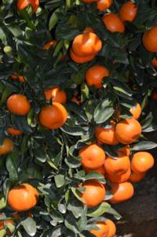

# CAP: Combining Cultural and Genetic Approaches for Grove Success to Unravel and Enhance Resistance/Tolerance to Huanglongbing

The research objective of this proposal is to investigate the root collapse associated with Huanglongbing (HLB)-impacted trees and ways to mitigate it by promoting root health. Our previous work demonstrates that as HLB severity increases, the root microbiome becomes enriched in soil-borne pathogens. We will conduct experiments to empirically determine if these pathogens exacerbate the HLB-associated root and canopy decline. We will integrate field studies that test HLB resistant/tolerant rootstocks and use of soil amendments that promote root health to determine if they suppress pathogens in the roots and prolong tree longevity/productivity under HLB pressure. These field studies will include newly established groves and mature groves. To support our field trials and decipher the genes/gene pathways that dictate how plants respond to HLB, we will determine how rootstocks and scions respond toCandidatusLiberibacter asiaticus using citrus varieties that are either highly HLB-susceptible or HLB-resistant using a combination of disease phenotyping and gene expression analyses. We will integrate this research with a robust extension and outreach program in combination with an economic cost-benefit analysis structured around adoption of treatments that enhance root health into commercial citriculture.

[NIFA abstract](https://cris.nifa.usda.gov/cgi-bin/starfinder/0?path=fastlink1.txt&id=anon&pass=&search=R=90282&format=WEBFMT6NT)

